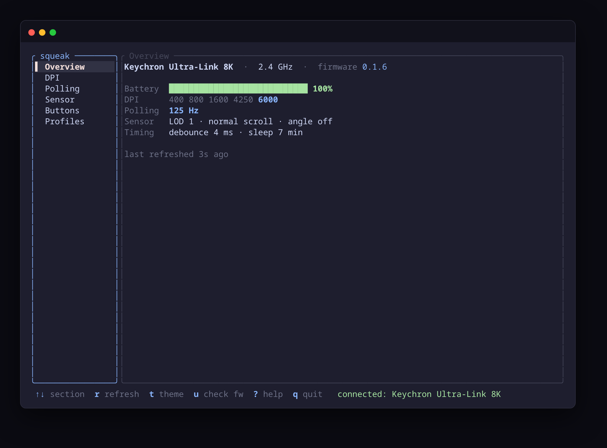

# squeak

Configure Keychron mice on Linux — DPI, polling rate, sensor, buttons, macros,
and profiles — over raw HID, replicating the web Launcher. Every write is read
back and verified.

Two frontends share one verified core (`squeak-core`):

| | |
|---|---|
| **[`squeak`](crates/squeak-tui/README.md)** (terminal UI) | ratatui, SSH-able, tiny, no GUI needed |
| **[`squeak-desktop`](crates/squeak-desktop/README.md)** (desktop app) | Tauri + WebKit, graphical window |

First-class target: **Keychron M6 8K / Ultra-Link 8K dongle** (`8k_nordic`,
VID `0x3434`), verified live over cable + 2.4 GHz. Plug/unplug is detected
automatically (netlink uevents — no device polling).



## Layout

```
crates/
  squeak-core/      proto · hid · worker  — shared, frontend-agnostic
  squeak-tui/       ratatui terminal UI    → crates/squeak-tui/README.md
  squeak-desktop/   Tauri desktop app      → crates/squeak-desktop/README.md
```

Pick a frontend's README for install + usage. The rest below is shared.

## Permissions

hidraw needs access (the browser Launcher needs this too). The repo ships the
rule at [`packaging/99-keychron.rules`](packaging/99-keychron.rules):

```bash
sudo curl -o /etc/udev/rules.d/99-keychron.rules \
  https://raw.githubusercontent.com/Stoica-Mihai/squeak/main/packaging/99-keychron.rules
sudo udevadm control --reload-rules && sudo udevadm trigger --action=add
# replug the device
```

The rule scopes to the M6's product IDs and tags them `uaccess`, granting the
active desktop login automatically:

```
SUBSYSTEM=="hidraw", ATTRS{idVendor}=="3434", ATTRS{idProduct}=="d028", MODE="0660", GROUP="input", TAG+="uaccess"
SUBSYSTEM=="hidraw", ATTRS{idVendor}=="3434", ATTRS{idProduct}=="d049", MODE="0660", GROUP="input", TAG+="uaccess"
```

On a normal desktop session that's all you need. Headless/ssh (where `uaccess`
doesn't apply) falls back to the `input` group — `sudo usermod -aG input $USER`
and re-login.

## Features

DPI presets + **active-stage switch** · polling rate · sensor (LOD, scroll dir,
motion sync, angle snapping with a settable degree, ripple, sampling mode) ·
debounce · sleep · button remap (mouse / media / disable / default) with a
**left-click lock** · macros (click sequences + text, auto-chunked over `0x71`)
· profile switching · factory reset.

Robustness: every write is read-back-verified; reconnect + retry on transport
errors; with both dongle and cable plugged it probes for the live one; hotplug
auto-refresh.

Gestures / tap-holds / combos are not supported by the M6 (its capability flags
don't advertise them).

## Protocol & reference

The HID protocol was reverse-engineered from the Keychron Launcher (WebHID) and
usbmon captures. Per-device maps are in [`docs/`](docs/) —
[`docs/8k-nordic.md`](docs/8k-nordic.md) is the verified device.
[`FINDINGS.md`](FINDINGS.md) is the RE log; [`capture.py`](capture.py) is the
usbmon decoder (`RAW=1` logs every report id); the archived Launcher JS bundles
are in [`docs/launcher/`](docs/launcher/). [`PLAN.md`](PLAN.md) is the plan.

## Status

8k_nordic is verified live (DPI, polling, sensor, buttons, macros, profile
switch — all read-back-confirmed), over both the cable and the Ultra-Link 8K
dongle. Other Keychron variants (1k / 4k / 8k) are documented from the Launcher
JS but unverified.
