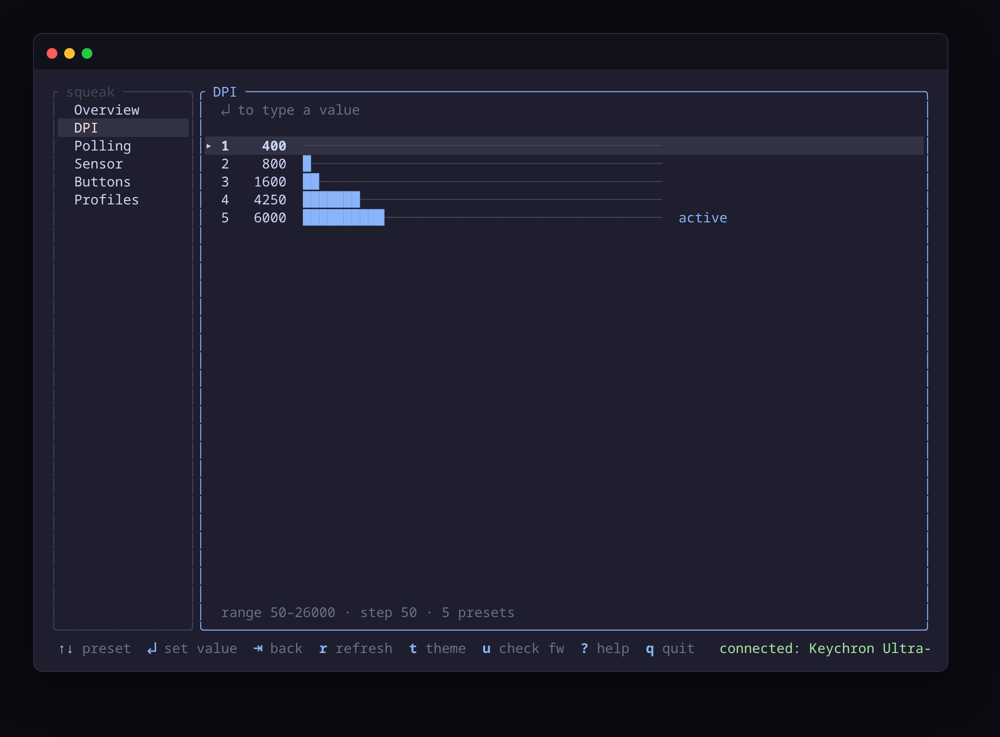
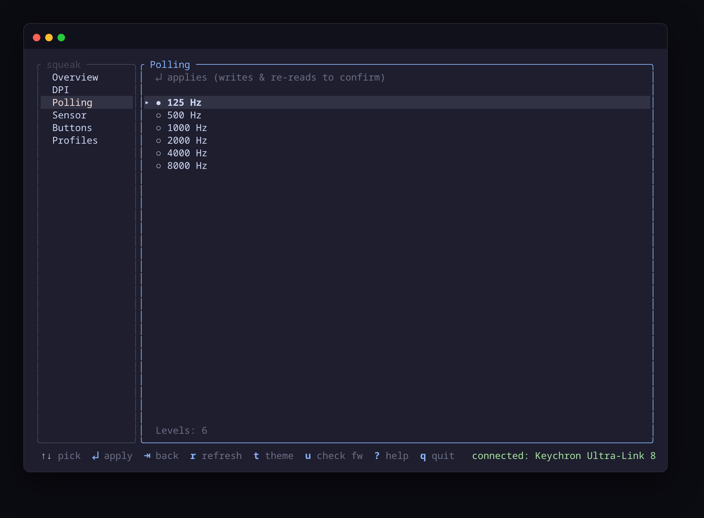
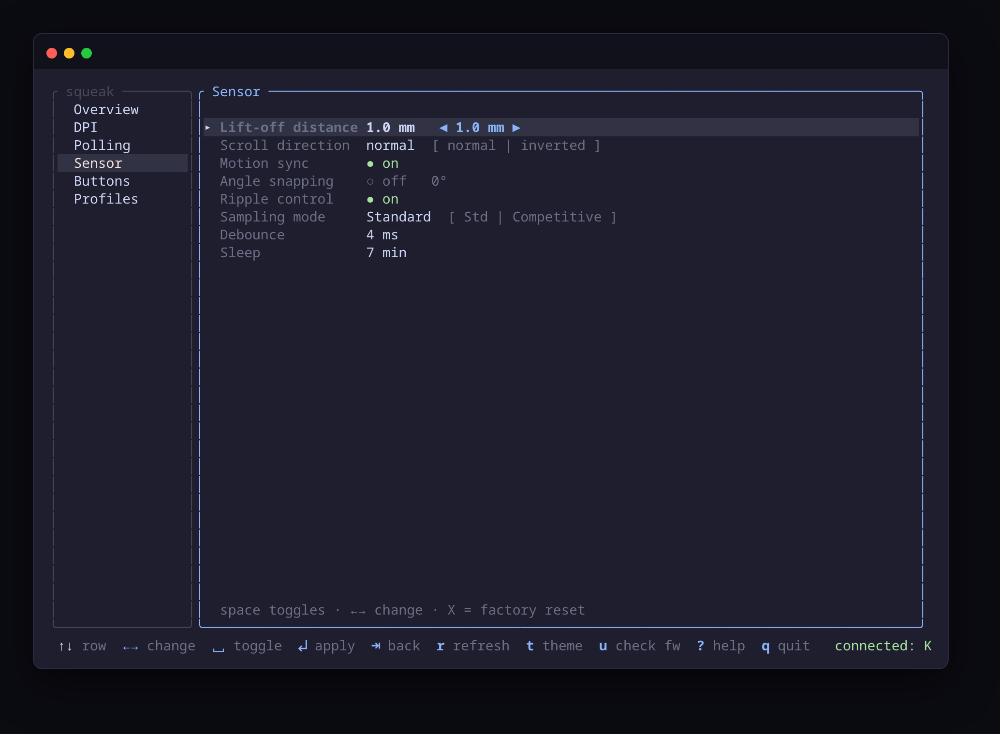
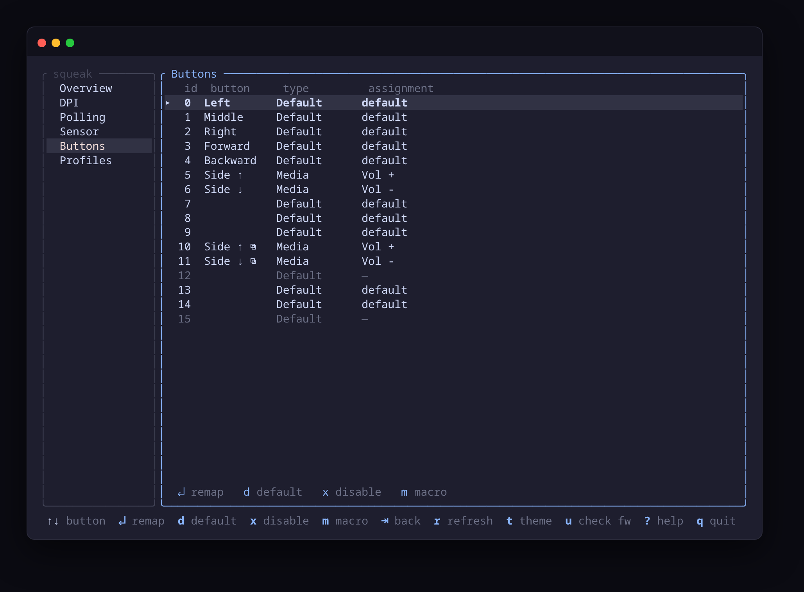
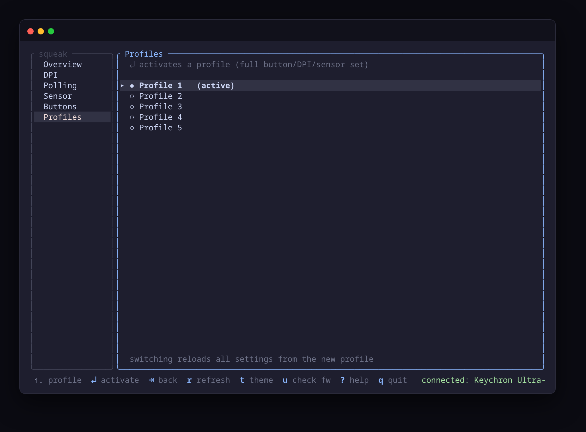
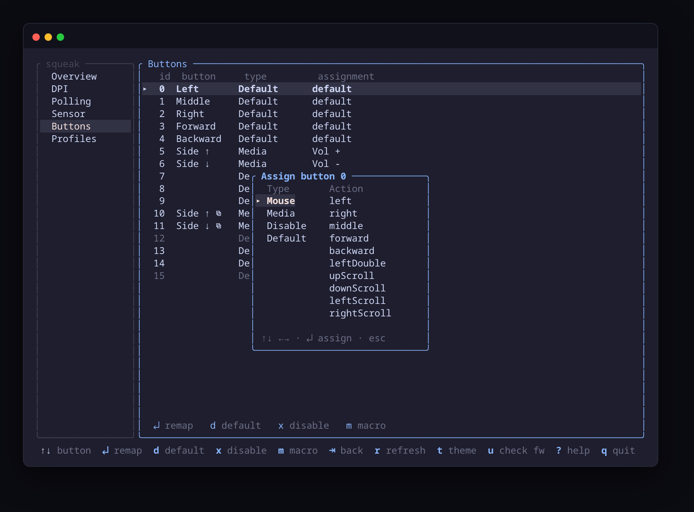
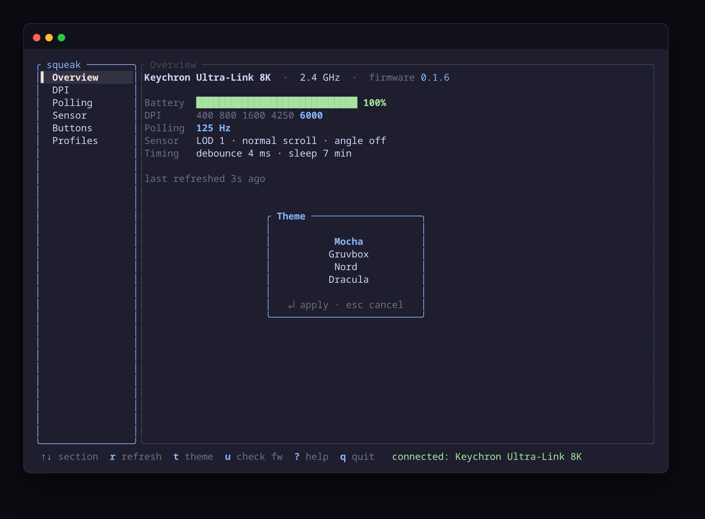
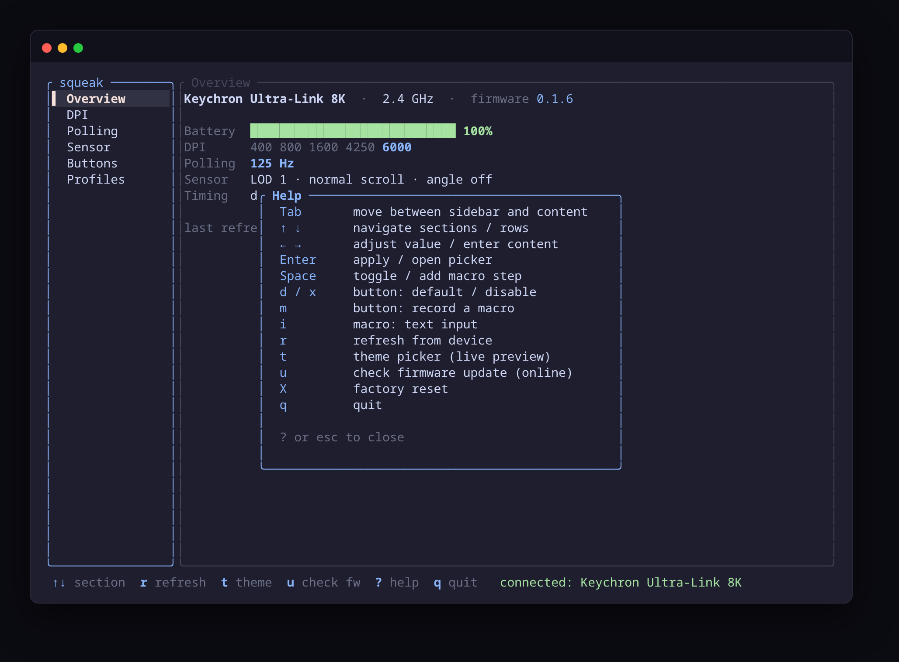

# squeak

A terminal UI to configure Keychron mice on Linux — DPI, polling rate, sensor,
buttons, macros, and profiles — over raw HID, replicating the web Launcher.
Every write is read back and verified.

First-class target: **Keychron M6 8K / Ultra-Link 8K dongle** (`8k_nordic`,
VID `0x3434`), verified live on firmware 0.1.6.


## Screens

Live captures against a real Ultra-Link 8K. Click to expand.

<details>
<summary><b>DPI</b> — five preset sliders, type or ±step, scaled to the sensor's range</summary>


</details>

<details>
<summary><b>Polling</b> — 125–8000 Hz, write + read-back verified</summary>


</details>

<details>
<summary><b>Sensor</b> — LOD, scroll dir, motion sync, angle snap, sampling, debounce, sleep</summary>


</details>

<details>
<summary><b>Buttons</b> — friendly names + decoded assignment for all 16 slots</summary>


</details>

<details>
<summary><b>Profiles</b> — switch the active on-device profile</summary>


</details>

<details>
<summary><b>Button picker</b> — assign mouse / media / disable / default</summary>


</details>

<details>
<summary><b>Theme picker</b> — live preview, ↵ confirm / esc revert</summary>


</details>

<details>
<summary><b>Help</b> — the full keymap (<kbd>?</kbd>)</summary>


</details>

## Install

Needs a Rust toolchain ≥ 1.85 (edition 2024). One command:

```bash
cargo install --git https://github.com/Stoica-Mihai/squeak --locked
```

This drops `squeak` in `~/.cargo/bin` (make sure that's on your `PATH`). No C
dependencies — pure-std `/dev/hidraw` for device I/O; the opt-in `u` firmware
check (looks up the latest version online — it does not flash) pulls in
`ureq`/`rustls`, everything else is offline.

Then set up [permissions](#permissions) once and you're done.

### From source

```bash
git clone https://github.com/Stoica-Mihai/squeak && cd squeak
cargo build --release
./target/release/squeak
```

## Permissions

hidraw needs group access (the browser Launcher needs this too). The repo
ships the rule at [`packaging/99-keychron.rules`](packaging/99-keychron.rules):

```bash
sudo curl -o /etc/udev/rules.d/99-keychron.rules \
  https://raw.githubusercontent.com/Stoica-Mihai/squeak/main/packaging/99-keychron.rules
sudo udevadm control --reload-rules && sudo udevadm trigger --action=add
# replug the dongle
```

The rule (for reference):

```
SUBSYSTEM=="hidraw", ATTRS{idVendor}=="3434", MODE="0660", GROUP="input"
```

Your user must be in the `input` group (`groups | grep input`; if not,
`sudo usermod -aG input $USER` and re-login).

(If a config node exists but `open` fails with EACCES, squeak shows the fix.)

## Usage

```bash
squeak              # launch the TUI
```

### Keys

Focus model: the **sidebar** (section list) and the **content** pane each take
focus.

| Key | Action |
|---|---|
| `Tab` | move focus between sidebar and content |
| `↑ ↓` | sidebar: change section · content: move row/selection |
| `→` / `Enter` | sidebar: enter content · content: apply / open picker |
| `Esc` | back to the sidebar |
| `r` | refresh from device · `t` theme · `u` check firmware version (online) · `?` help · `X` factory reset · `q` quit |

Per screen (content focus):

- **DPI** — `↑↓` pick a preset, `Enter` to type an exact value (50–26000).
- **Polling** — `↑↓` pick a rate, `Enter` apply (`●` = current).
- **Sensor** — `↑↓` row, `←→` change, `Space` toggle; `Enter` shows a diff and
  applies. Edited-but-unapplied rows are marked `✎ unsaved`.
- **Buttons** — `↑↓` a button; `Enter` opens the action picker
  (Mouse / Media / Disable / Default), `d` default, `x` disable, `m` record a
  macro (modal).
- **Profiles** — `↑↓` pick, `Enter` activate (reloads the whole config).

`t` opens a theme picker — `↑↓` previews each theme live (the whole UI
recolors), `↵` confirms, `esc` reverts to the previous one.

`u` checks for a firmware update — the **only** thing that touches the network,
and only when you press it. It queries the Keychron Launcher API for the latest
version and shows `✓ latest` / `⬆ X available` on the Overview firmware line
(silent if offline). squeak does not flash firmware.

## Features

DPI presets · polling rate · sensor (LOD, scroll dir, motion sync, angle snap,
ripple, sampling mode) · debounce · sleep · button remap (mouse / media /
keyboard via the reference CLI) · macros (click sequences + text, auto-chunked
over `0x71`) · profile switching · factory reset. Themes: Mocha, Gruvbox, Nord,
Dracula (`t`).

Gestures / tap-holds / combos are not supported by the M6 (its capability flags
don't advertise them).

## Protocol & reference implementation

The HID protocol was reverse-engineered from the Keychron Launcher (WebHID) and
usbmon captures. Per-device maps are in [`docs/`](docs/) —
[`docs/8k-nordic.md`](docs/8k-nordic.md) is our verified device.
[`FINDINGS.md`](FINDINGS.md) is the RE log; [`capture.py`](capture.py) is the
usbmon decoder (`RAW=1` logs every report id); the archived Launcher JS bundles
the protocol was decoded from are in [`docs/launcher/`](docs/launcher/).
[`PLAN.md`](PLAN.md) is the implementation plan.

## Status

8k_nordic is verified live (DPI, polling, sensor, buttons, macros, profile
switch — all read-back-confirmed on the Ultra-Link 8K dongle). Other Keychron
variants (1k / 4k / 8k) are documented from the Launcher JS but unverified.
