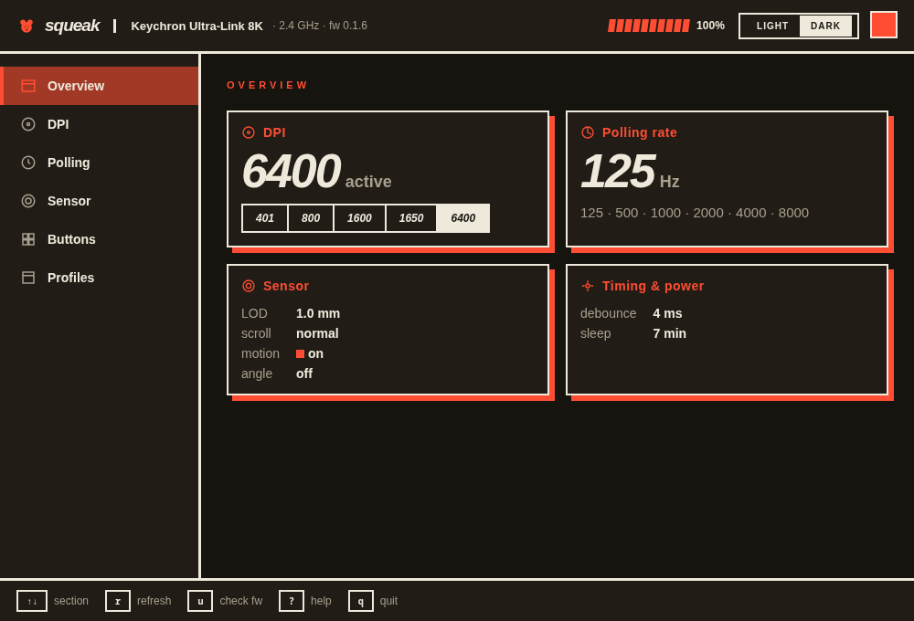
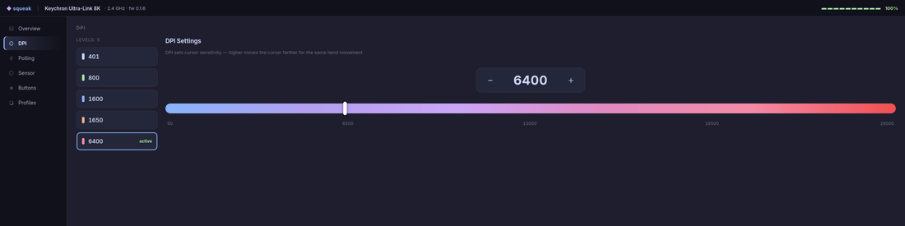
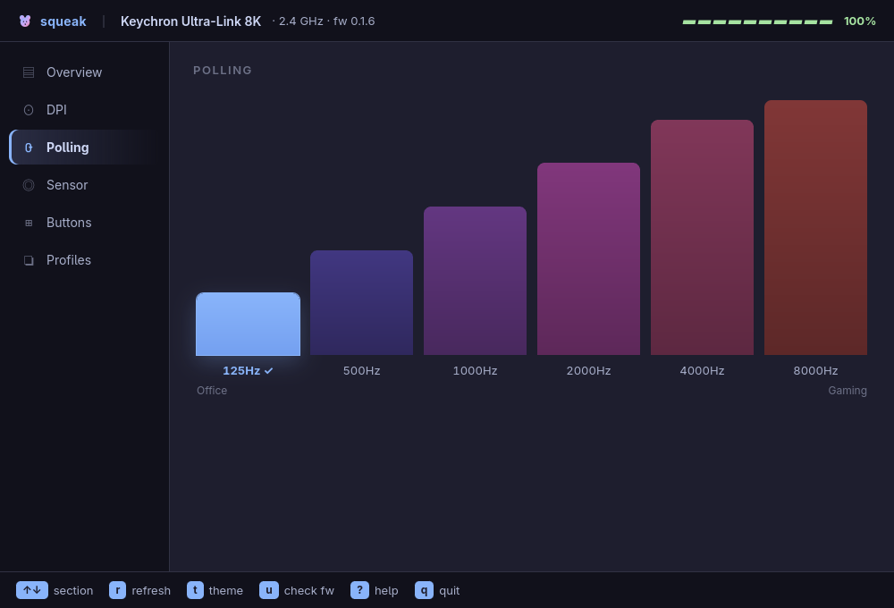
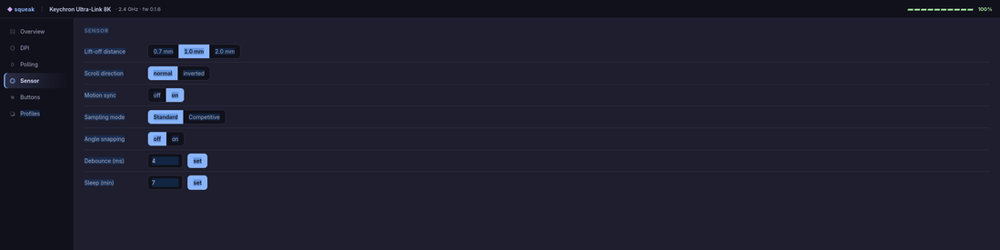
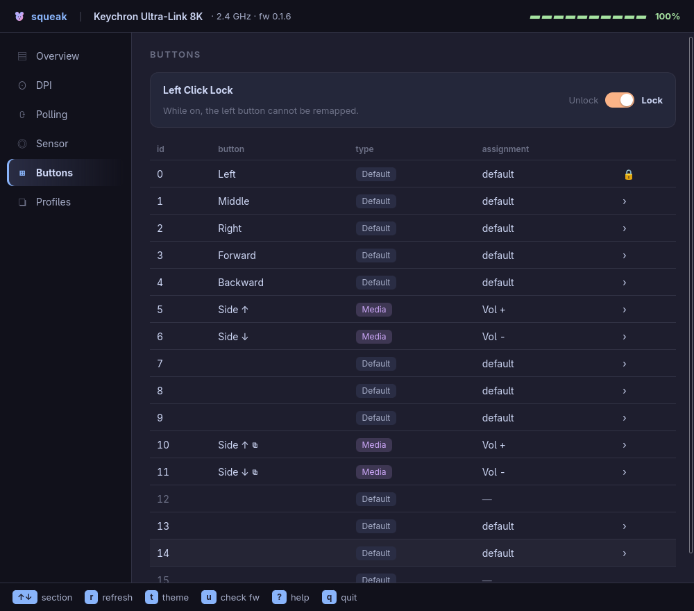
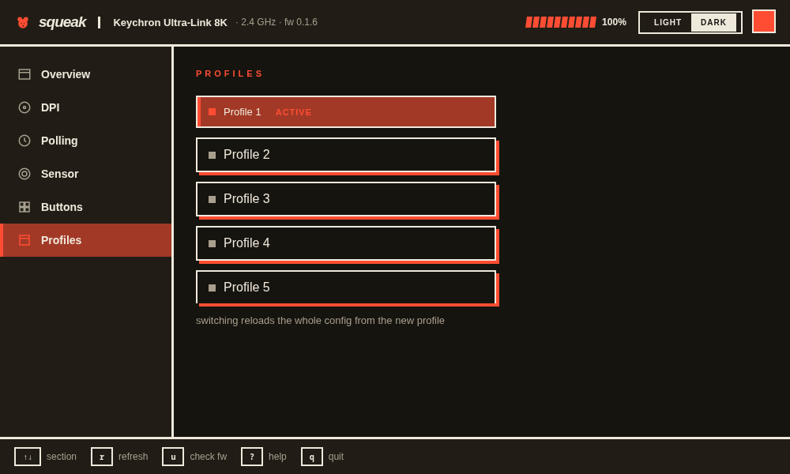

# squeak-desktop

The desktop frontend — a [Tauri 2](https://tauri.app) app: a Rust backend over
[`squeak-core`](../squeak-core) with a static HTML/CSS/JS UI rendered in the
OS WebKit view. Same verified protocol as the TUI, rendered with CSS — cards,
gradient sliders, theme picker. See the [root README](../../README.md)
for the project overview, permissions, and protocol.

Click-and-keyboard driven, needs a graphical session (no SSH/headless).



## Build & run

Needs a Rust toolchain ≥ 1.85 and the WebKitGTK stack:

```bash
# Arch:    sudo pacman -S webkit2gtk-4.1 libsoup3
# Debian:  sudo apt install libwebkit2gtk-4.1-dev libsoup-3.0-dev
cargo run -p squeak-desktop
# release bundle (.deb / AppImage): cargo build --release -p squeak-desktop
```

Set up [permissions](../../README.md#permissions) once.

### Install system-wide + launcher entry

The Tauri binary embeds its frontend, so it's self-contained. From the repo:

```bash
./packaging/install-desktop.sh
```

Installs `squeak-desktop` to `/usr/local/bin` and a `.desktop` entry + icon
under `~/.local/share`, so **squeak** shows up in your app launcher. (Uninstall
hint is printed at the end.)

Or build a distro package with the Tauri bundler (needs `cargo install
tauri-cli`): `cargo tauri build` → `.deb` / `.rpm` / AppImage under
`target/release/bundle/`.

## UI

- **Sidebar** nav: Overview · DPI · Polling · Sensor · Buttons · Profiles.
- **Overview** — device statusline (name · transport · firmware · battery) over
  cards; each card links to its edit screen.
- **DPI** — preset list (click to activate), a stepper you can type into, and a
  gradient slider with ticks.
- **Polling** — a bar chart (Office → Gaming), click a bar to set the rate.
- **Sensor** — segmented toggles + angle degree + debounce/sleep inputs.
- **Buttons** — table of all 16 slots; click to remap (Mouse / Media / Disable
  / Default). A **Left Click Lock** guards the left button.
- **Profiles** — pick the active on-device profile.

<details>
<summary>Screens</summary>






</details>

## Shortcuts

`↑↓` switch section · `r` refresh · `t` theme picker (live preview) ·
`u` check firmware · `?` help overlay · `q` quit · `Esc` close a dialog.

Every edit goes through `squeak-core`'s worker (write + read-back verify);
results show as toasts. Plug/unplug auto-refreshes (netlink uevents).
